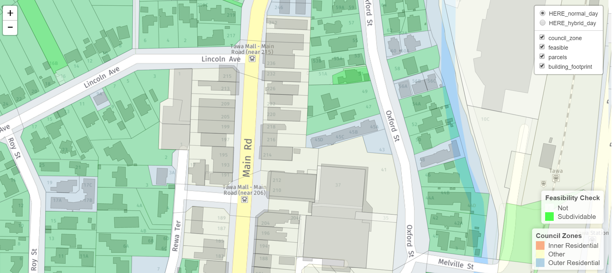

```{r setup, include=FALSE}
knitr::opts_chunk$set(echo = TRUE)
```

## Simploction Map

This is a leaflet map for GovHack 2017.
Shows what is feasible to subdivide based on section area, building footprint, council zoning and district plan rules.



# Datasources:

* HERE MAPs API for base map (hybrid day)
* HERE MAPs API for base map (normal day)
* LINZ Parcels
* Wellington City Council (zoning map)
* Wellington City Council (building footprints)
* Wellington City council district plan rules
